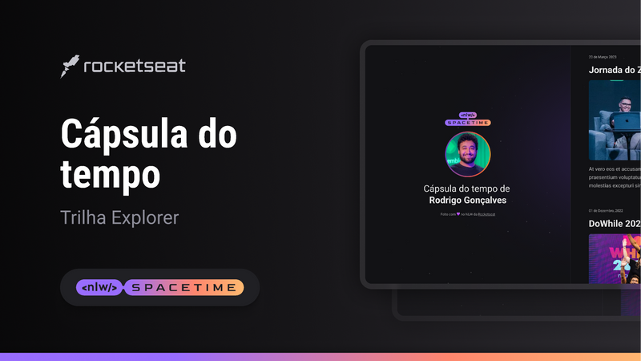

 
  

## Projeto 👨‍💻
Projeto WEB Responsivo desenvolvido durante a NLW Spacetime 🚀 capsula do tempo para exibir memorias em uma linha do tempo 

## Tecnologias 💻
Este projeto utilizou:

- HTML
- CSS
- GIT

## Layout 🏷

Layout inspiração [aqui](https://www.figma.com/community/file/1240071097028170811)